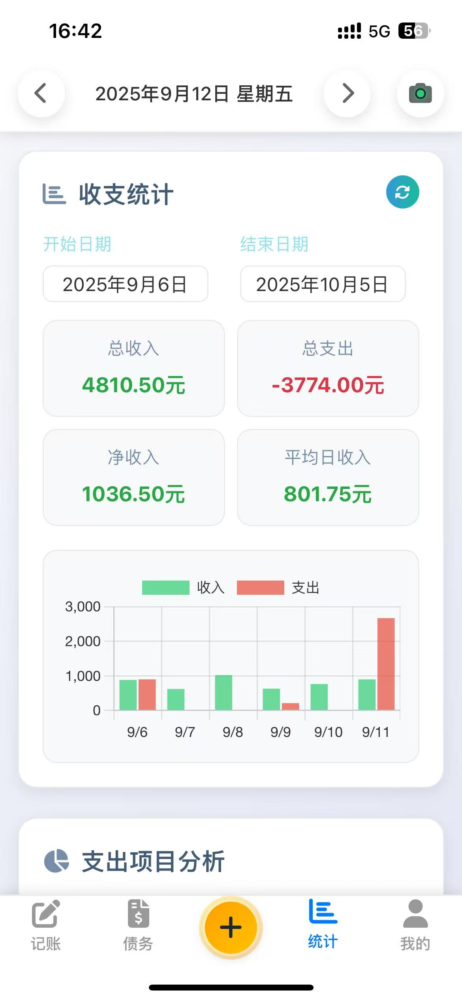

<div align="center">

# 🧾 E7 Chess Room Accounting System

[](#)
[](#)
[](#)
[](#)

</div>

---

<div align="center">

## Language Selection

- [中文](README.md) • [English](README_EN.md)

</div>

---

## 📖 Project Overview

**E7 Chess Room Accounting System** is a modern accounting solution designed specifically for chess rooms. This system features an intuitive user interface, powerful data synchronization capabilities, and offline support to help you easily manage daily income and expense records.

---

## 🚀 Feature Updates

This update introduces several significant improvements:

- **Core Accounting Function Refactoring**: Optimized the underlying code for the accounting process, enhancing performance and stability.
- **Navigation Bar Tab Layout Optimization**: Merged redundant navigation tab items for a more streamlined and efficient navigation experience.
- **New Data Management Module**: Introduced robust data management features, allowing users to easily import, export, and perform batch operations on their data.

---

## 📸 Application Preview

<div align="center" style="margin-bottom: 30px;">
  <div style="margin-bottom: 20px;">
    
    
  </div>
  <div>
    
    
  </div>
</div>

---

## ✨ Key Features

- 📱 **Responsive Design** - Perfectly adapts to mobile and tablet devices
- 🌐 **PWA Support** - Can be installed as a native app with offline support
- 💾 **Data Synchronization** - Automatically syncs data between cloud and local storage
- 📊 **Statistical Analysis** - Provides detailed income/expense statistics and chart visualization
- 🎤 **Voice Recognition** - Supports voice-activated quick accounting
- 🌙 **Dark Mode** - Protects your eyes with comfortable night-time usage
- 📸 **Screenshot Sharing** - One-click generation of accounting record images
- 🧮 **Debt Management** - Intelligent calculation and tracking of debt situations
- 🗄️ **Data Management** - Supports data import/export and batch operations

---

## 🏗️ System Architecture

```
┌─────────────────┐    ┌─────────────────┐    ┌─────────────────┐
│   Frontend      │    │   Backend       │    │   Data Storage  │
│  (Vue.js PWA)   │◄──►│ (Cloudflare API)│◄──►│ (KV + R2)       │
└─────────────────┘    └─────────────────┘    └─────────────────┘
       │                        │                        │
       ▼                        ▼                        ▼
┌─────────────────┐    ┌─────────────────┐    ┌─────────────────┐
│   Offline       │    │   Data Sync     │    │   Auto Backup   │
│ (LocalStorage)  │    │ (Online/Offline)│    │ (Scheduled)     │
└─────────────────┘    └─────────────────┘    └─────────────────┘
```

---

## 🛠️ Tech Stack

- **Frontend Framework**: Vue.js 2.6
- **Styling**: CSS3 + Flexbox
- **Icons**: Font Awesome 6.4
- **Charts**: Chart.js 3.9
- **Screenshot**: html2canvas 1.4
- **Backend**: Cloudflare Pages Functions
- **Database**: Cloudflare KV
- **Storage**: Cloudflare R2
- **Deployment**: Cloudflare Pages

---

## 🚀 Installation & Deployment

### Dependencies

- **Node.js**: Please ensure Node.js is installed (LTS version recommended).
- **npm/yarn**: Node.js package manager, used for installing project dependencies.
- **Cloudflare CLI (Optional)**: If you plan to deploy to Cloudflare Pages, it's recommended to install the Cloudflare CLI (`npm install -g @cloudflare/wrangler`).

### Local Development

1.  **Clone the repository**:
    ```bash
    git clone https://github.com/Black17999/e7-accounting-system.git
    cd e7-accounting-system
    ```
2.  **Install dependencies**:
    ```bash
    npm install
    # Or using yarn
    # yarn install
    ```
3.  **Start the local development server**:
    ```bash
    # Using serve (if not installed, install globally first: npm install -g serve)
    npx serve
    # Or using Python's built-in server (Python 3)
    # python -m http.server 8000
    ```
4.  **Access the application**:
    Open your browser and visit `http://localhost:8000` (or the port provided by serve).

### Deploy to Cloudflare

1.  Create a Pages project in the Cloudflare dashboard.
2.  Connect your GitHub repository.
3.  Configure build settings:
    *   Build command: `npm run build` (if your project requires a build step)
    *   Output directory: `/` (or your build output directory)
4.  Add environment variables:
    *   `DB`: KV namespace binding
    *   `DB_BACKUPS`: R2 bucket binding

---

## 📚 Usage Guide

### Accounting Features

1.  **Add Income** - Click the bottom "+" button and select the income icon.
2.  **Add Expense** - Click the bottom "+" button and select the expense icon.
3.  **Voice Accounting** - Click the microphone icon at the bottom and speak accounting commands.
4.  **Edit Records** - Swipe left/right on a record item and click the edit button.
5.  **Delete Records** - Swipe left/right on a record item and click the delete button.

### Debt Management

1.  **Add Debt** - Enter name and expression on the debt page.
2.  **Update Debt** - Click on a debt item to edit.
3.  **Delete Debt** - Swipe left/right on a debt item and click the delete button.

### Statistical Analysis

1.  **View Statistics** - Click the statistics icon at the bottom.
2.  **Switch Time Range** - Use weekly view, monthly view, or custom dates.
3.  **View Charts** - Click on the chart area to view in full screen.

### Data Management (New)

1.  **Data Import** - On the data management page, select a local file for import.
2.  **Data Export** - Select the data range to export, then click the export button to generate a file.
3.  **Batch Operations** - Supports batch deletion or modification of multiple records.

---

## 🔧 Development Notes

### Project Structure

```
e7-accounting-system/
├── index.html          # Main page
├── main-modular.js     # Vue app main file (modular)
├── style.css           # Stylesheet
├── sw.js               # Service Worker
├── manifest.json       # PWA configuration file
├── splash.html         # Splash screen
├── splash.css          # Splash screen styles
├── functions/          # Cloudflare Functions
│   └── api/
│       └── [[path]].js # API handler functions
├── wrangler.toml       # Deployment configuration file
├── assets/             # Assets folder
│   ├── icon-192.png    # App icon
│   ├── icon-512.png    # App icon
│   ├── splash.png      # Splash screen screenshot
│   ├── home.png        # Home screen screenshot
│   ├── profile.png     # Profile screen screenshot
│   └── stats.png       # Statistics screen screenshot
└── README_EN.md        # Project documentation
```

### Core Modules

1.  **Data Sync Module** - Handles online/offline data synchronization.
2.  **Accounting Module** - Manages income and expense records.
3.  **Debt Module** - Manages debt calculation and tracking.
4.  **Statistics Module** - Generates charts and statistical data.
5.  **UI Module** - Handles user interface and interactions.
6.  **Data Management Module** - Provides data import, export, and batch processing functionality.

---

## ❓ Frequently Asked Questions (FAQ)

**Q: How do I install project dependencies?**
A: Run `npm install` or `yarn install` in the project's root directory.

**Q: How do I start the local development server?**
A: Run `npx serve` or use Python's `python -m http.server 8000`.

**Q: How do I use the new Data Management module?**
A: Please refer to the "Usage Guide" section on "Data Management" to learn how to import/export data and perform batch operations.

**Q: What if I encounter deployment issues?**
A: Check Cloudflare's build logs and environment variable configurations for accuracy. Consult the Cloudflare Pages documentation if you have further questions.

---

## 🤝 Contribution

Welcome any form of contribution! Please follow these steps:

1.  Fork the project
2.  Create a feature branch (`git checkout -b feature/AmazingFeature`)
3.  Commit your changes (`git commit -m 'Add some AmazingFeature'`)
4.  Push to the branch (`git push origin feature/AmazingFeature`)
5.  Open a Pull Request

## 📄 License

This project is licensed under the MIT License - see the [LICENSE](LICENSE) file for details
